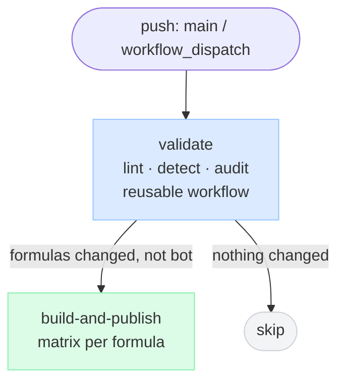
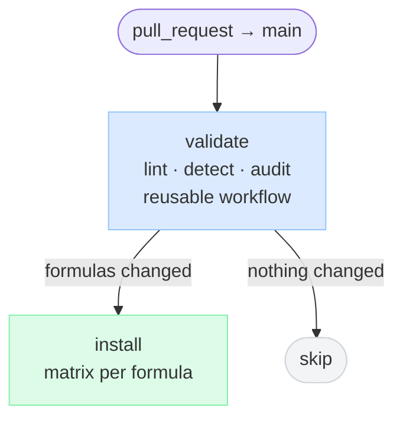
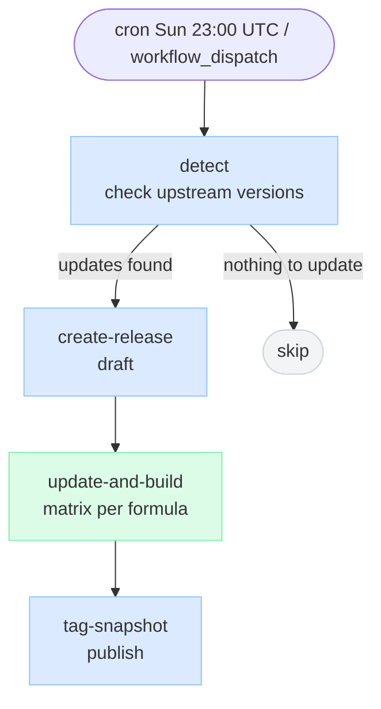
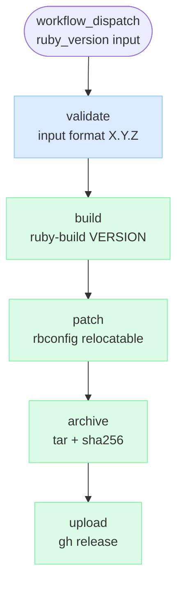

# CI Pipeline Diagrams

## 1. Build Bottles — Push to Main

```mermaid
flowchart TD
    T([push: main / workflow_dispatch])

    VALIDATE[validate\nlint · detect · audit\nreusable workflow]
    BUILD[build-and-publish\nmatrix per formula]
    SKIP([skip])

    T --> VALIDATE
    VALIDATE -->|formulas changed, not bot| BUILD
    VALIDATE -->|nothing changed| SKIP

    style VALIDATE fill:#dbeafe,stroke:#93c5fd
    style BUILD    fill:#dcfce7,stroke:#86efac
    style SKIP     fill:#f3f4f6,stroke:#d1d5db
```

## 2. Validate PR — Pull Request

```mermaid
flowchart TD
    T([pull_request → main])

    VALIDATE[validate\nlint · detect · audit\nreusable workflow]
    INSTALL[install\nmatrix per formula]
    SKIP([skip])

    T --> VALIDATE
    VALIDATE -->|formulas changed| INSTALL
    VALIDATE -->|nothing changed| SKIP

    style VALIDATE fill:#dbeafe,stroke:#93c5fd
    style INSTALL  fill:#dcfce7,stroke:#86efac
    style SKIP     fill:#f3f4f6,stroke:#d1d5db
```

## 3. Auto Update — Weekly

```mermaid
flowchart TD
    T([cron Sun 23:00 UTC / workflow_dispatch])

    DETECT[detect\ncheck upstream versions]
    CREATE[create-release\ndraft]
    BUILD[update-and-build\nmatrix per formula]
    TAG[tag-snapshot\npublish]
    SKIP([skip])

    T --> DETECT
    DETECT -->|updates found| CREATE
    DETECT -->|nothing to update| SKIP
    CREATE --> BUILD
    BUILD --> TAG

    style DETECT fill:#dbeafe,stroke:#93c5fd
    style CREATE fill:#dbeafe,stroke:#93c5fd
    style BUILD  fill:#dcfce7,stroke:#86efac
    style TAG    fill:#dbeafe,stroke:#93c5fd
    style SKIP   fill:#f3f4f6,stroke:#d1d5db
```

## 4. Build Ruby Runtime — Manual

```mermaid
flowchart TD
    T([workflow_dispatch\nruby_version input])

    VALIDATE[validate\ninput format X.Y.Z]
    BUILD[build\nruby-build VERSION]
    PATCH[patch\nrbconfig relocatable]
    ARCHIVE[archive\ntar + sha256]
    UPLOAD[upload\ngh release]

    T --> VALIDATE --> BUILD --> PATCH --> ARCHIVE --> UPLOAD

    style VALIDATE fill:#dbeafe,stroke:#93c5fd
    style BUILD    fill:#dcfce7,stroke:#86efac
    style PATCH    fill:#dcfce7,stroke:#86efac
    style ARCHIVE  fill:#dcfce7,stroke:#86efac
    style UPLOAD   fill:#dcfce7,stroke:#86efac
```
