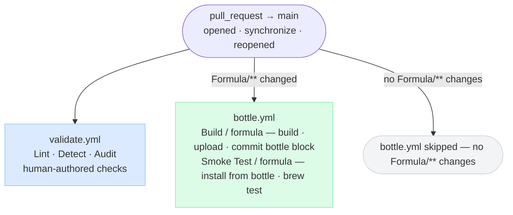
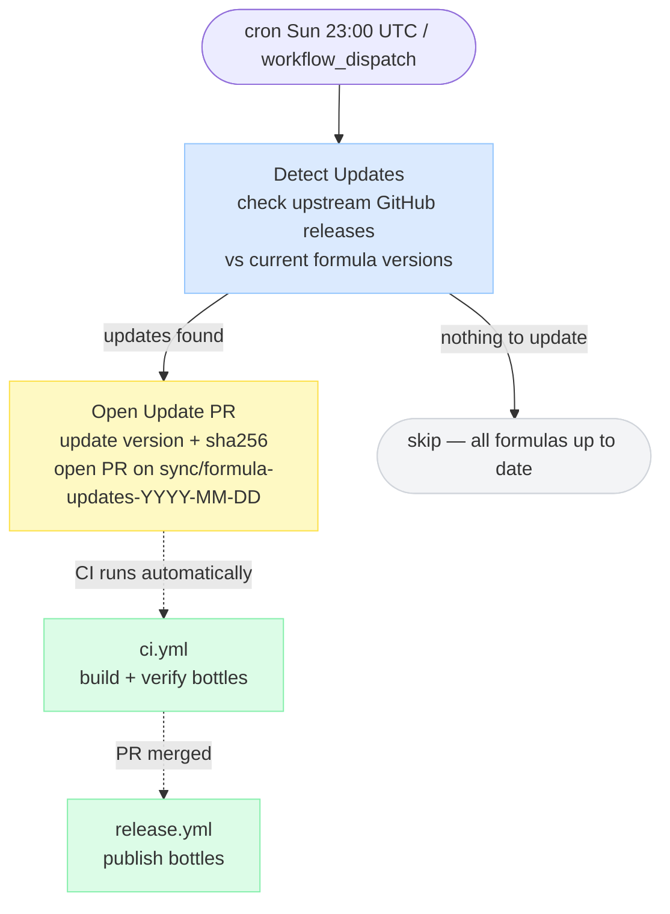
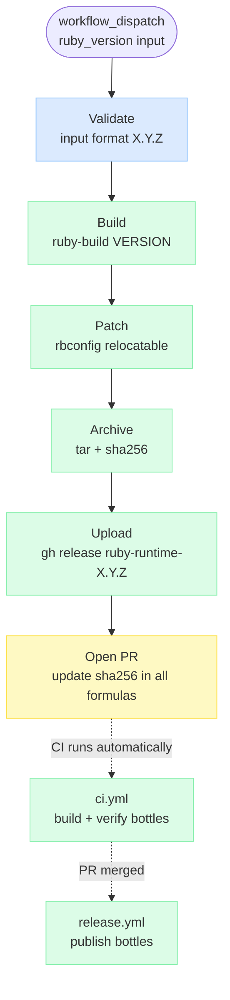

# CI Pipeline Diagrams

## 1. Pull Request — `validate.yml` + `bottle.yml`

PR checks are split by concern: `validate.yml` runs the human-authored
checks, `bottle.yml` runs the bot-authored build + smoke test. They run
in parallel; both must pass before merge.

When a PR is **closed without merging**, `cleanup.yml` fires and deletes
any prerelease that was created during CI.

---

## 2. Release — Push to Main (`release.yml`)

Triggered when a PR merges. Publishes the prerelease that was already built
and verified during PR CI. No bottle is built here.

---

## 3. Sync Formulas — Weekly (`sync-formulas.yml`)

---

## 4. Build Ruby Runtime — Manual (`build-ruby-runtime.yml`)

