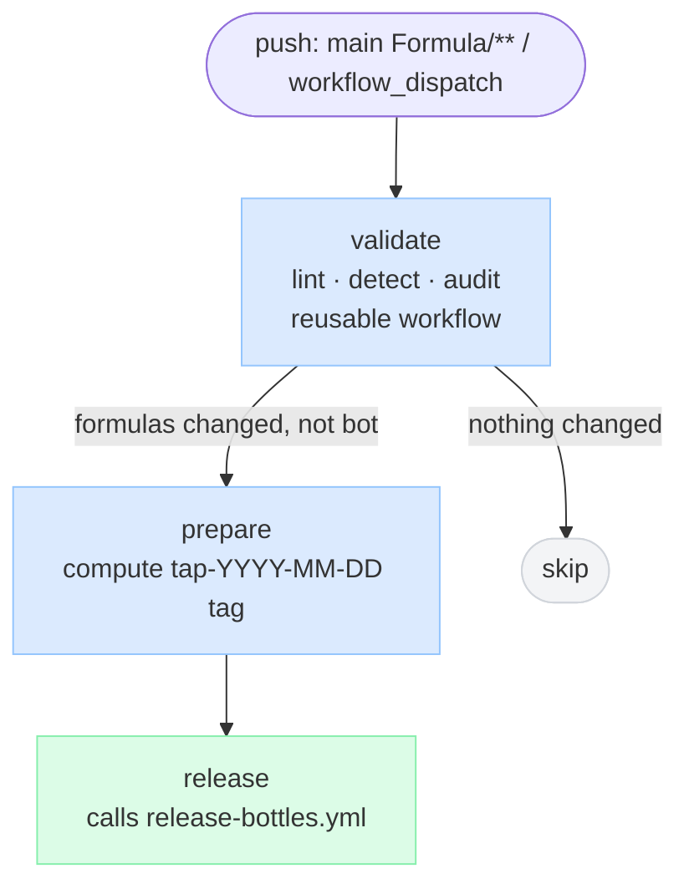
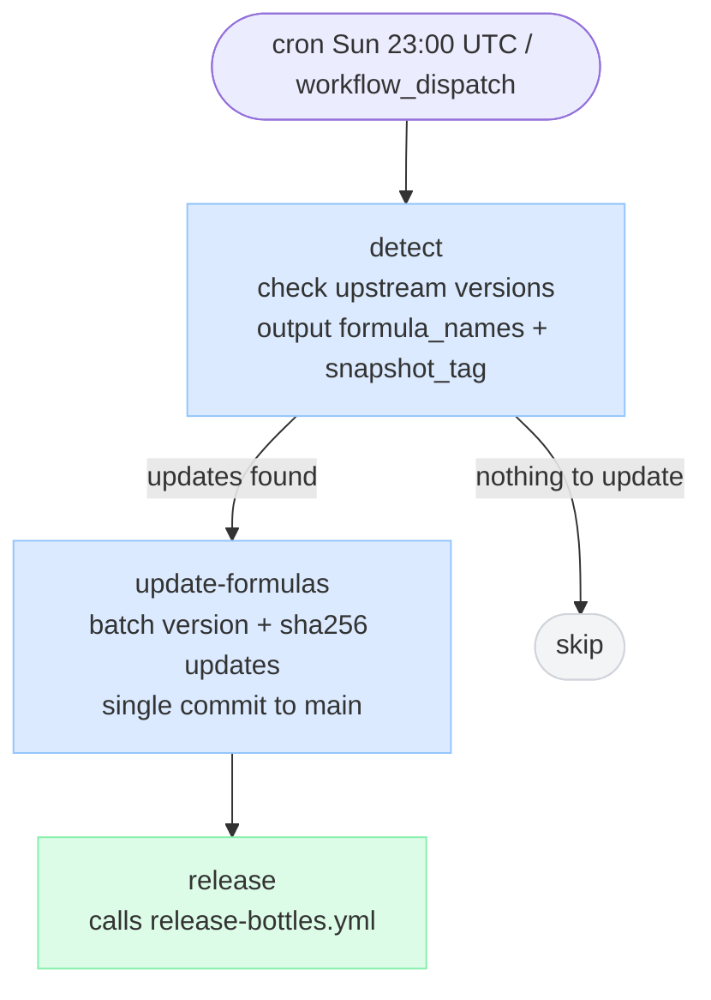
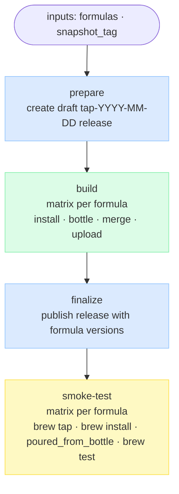
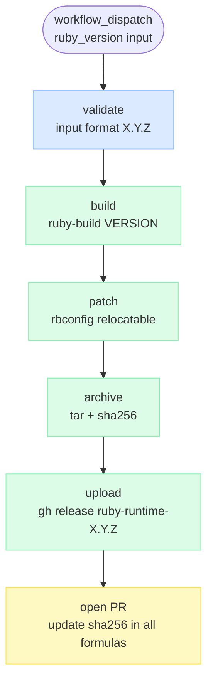

# CI Pipeline Diagrams

## 1. Build Bottles — Push to Main

## 2. Validate PR — Pull Request

## 3. Sync Formulas — Weekly

## 4. Release Bottles — Reusable

_Called by Build Bottles and Sync Formulas._

## 5. Build Ruby Runtime — Manual

