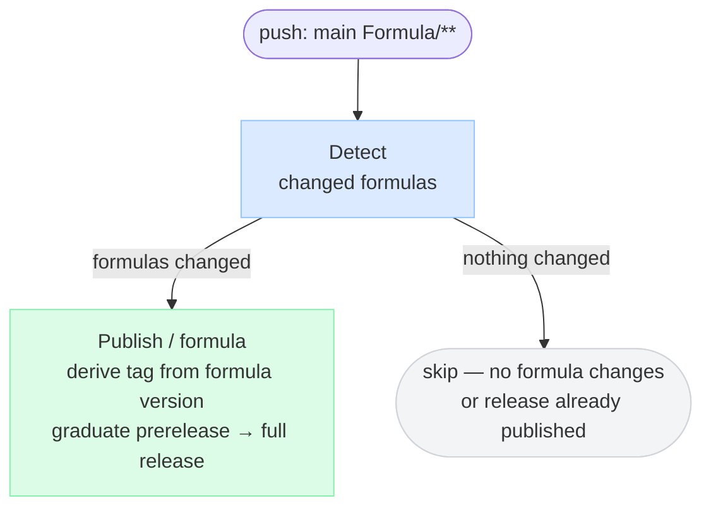
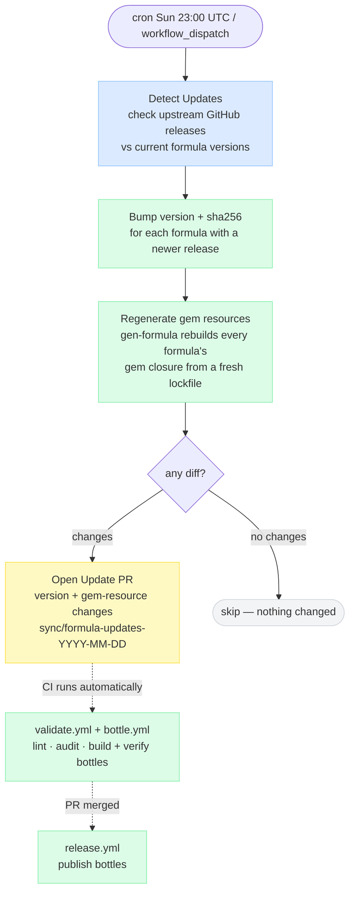
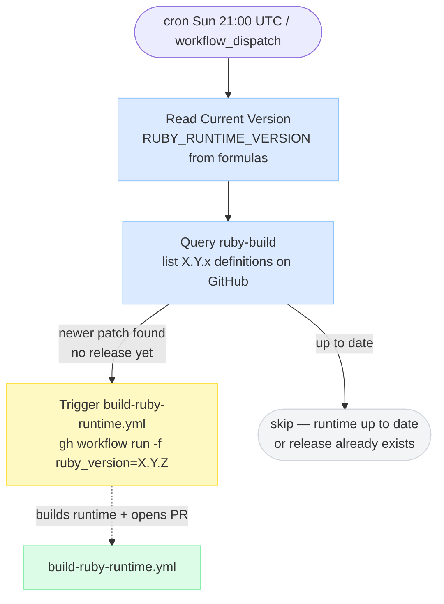
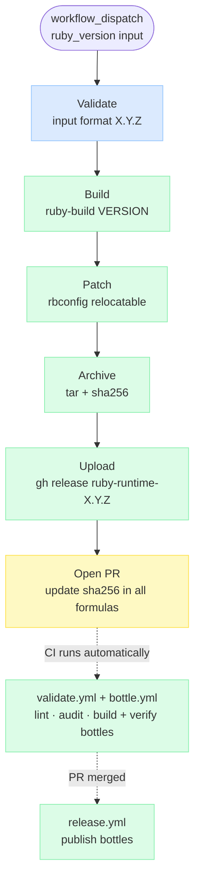

# CI Pipeline Diagrams

## 1. Pull Request — `validate.yml` + `bottle.yml`

PR checks are split by concern: `validate.yml` runs the human-authored
checks, `bottle.yml` runs the bot-authored build + smoke test. They run
in parallel; both must pass before merge.

`bottle.yml` short-circuits via a `# bottle-source-digest:` check: it rebuilds
only when the formula's install-relevant content (everything except the bottle
block) has changed. This catches same-version gem-resource updates while the
bot's bottle commit-back still skips re-building on its own push.

When a PR is **closed without merging**, `cleanup.yml` fires and deletes
any prerelease that was created during CI.

---

## 2. Release — Push to Main (`release.yml`)

Triggered when a PR merges. Publishes the prerelease that was already built
and verified during PR CI. No bottle is built here.

---

## 3. Sync Formulas — Weekly (`sync-formulas.yml`)

One weekly job bumps source versions **and** regenerates gem resources. After
any version bump it runs `gen-formula`, and it also regenerates every formula
unconditionally to catch same-version gem drift. Only real diffs get committed,
so an all-current run opens no PR. (The retired `sync-gems.yml` is folded in
here.)

---

## 4. Sync Ruby Runtime — Weekly (`sync-ruby-runtime.yml`)

---

## 5. Build Ruby Runtime — Manual / Auto (`build-ruby-runtime.yml`)

